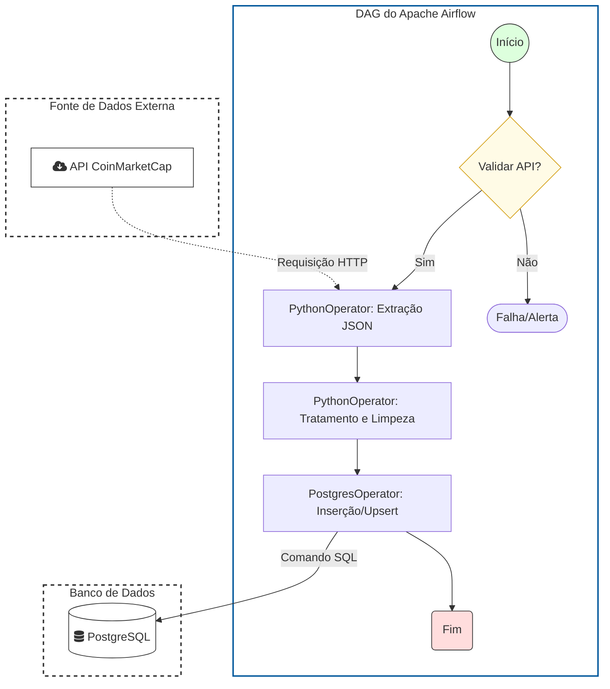

# Engenharia de Dados na Prática: Pipeline ETL de dados do coin market cap - Nível Iniciante 
(adaptado de https://www.youtube.com/watch?v=I8qPqbXQBDU&t=2126s)

## ✒️ 
Para mais informações sobre como implementar esse projeto, visite https://github.com/vbluuiza/pipeline_etl_weather_data_tutorial_youtube
